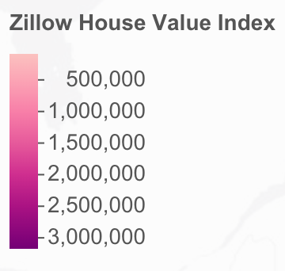

```{r setup, include=FALSE}
knitr::opts_chunk$set(echo = FALSE)
library(sf)
library(janitor)
library(tigris)
library(tmap)
library(grid)
library(tidyverse)

prices <- read_csv("clean-data/all_housing_data.csv",
                   col_types = cols(.default = col_double(),
                                    city = col_character(),
                                    state = col_character(),
                                    metro = col_character(),
                                    county_name = col_character(),
                                    date = col_character())) %>%
  filter(date %in% c("1999-10-01", "2009-10-01", "2019-10-01"))

options(tigris_use_cache = TRUE)
```

```{r, cache = TRUE, include = FALSE}
# getting geometries for zip codes using the tigris package for only 
# the regions represented in the zhvi dataset, found by looking at
# prices %>% distinct(zip_code) %>% arrange(zip_code)

zips = c("07", 
         "08", 
         "10", 
         "11", 
         "124", 
         "125", 
         "127", 
         "183", 
         "184", 
         "94", 
         "98")

shape <- zctas(starts_with = zips,
               class = "sf") %>% 
  clean_names() %>%
  mutate(zip_code = as.numeric(zcta5ce10)) %>% 
  mutate(metro = ifelse(zip_code < 94000, 
                        "New York-Newark-Jersey City",
                        ifelse(zip_code < 98000,
                               "San Francisco-Oakland-Hayward",
                               "Seattle-Tacoma-Bellevue")))

prices_shape <- shape %>% 
  left_join(prices, by = c("zip_code", "metro"))

tmap_mode("view")
tmap_options(limits = c(facets.view = 9))

interactive <- tm_shape(prices_shape) +
  tm_polygons("zhvi", 
              style = "log10", 
              palette = "RdPu", 
              contrast = c(0.2,1),
              lwd = 0,
              popup.vars = c("ZHVI" = "zhvi",
                             "List Price/Sq Ft" = "sale_list_prices_sqft", 
                             "City" = "city"),
              legend.show = FALSE) +
  tm_facets(by = c("date", "metro"), 
            ncol = 3, 
            free.scales = FALSE, 
            drop.empty.facets = TRUE, 
            drop.NA.facets = TRUE) +
  tm_layout(title = c("NYC Metro Area 1999", "SF Metro Area 1999", "Seattle Area 1999",
                      "NYC Metro Area 2009", "SF Metro Area 2009", "Seattle Area 2009",
                      "NYC Metro Area 2019", "SF Metro Area 2019", "Seattle Area 2019")) 

# This legend is a screenshot of the legend produced by the interactive map.
# However, the tmap package does not have a way to display only one legend when there are
# multiple facets, so I have utilized this workaround so that the legend will not distract
# from the maps

legend <- 
```

```{r}
par(mfrow=c(1,2))
interactive
legend
```